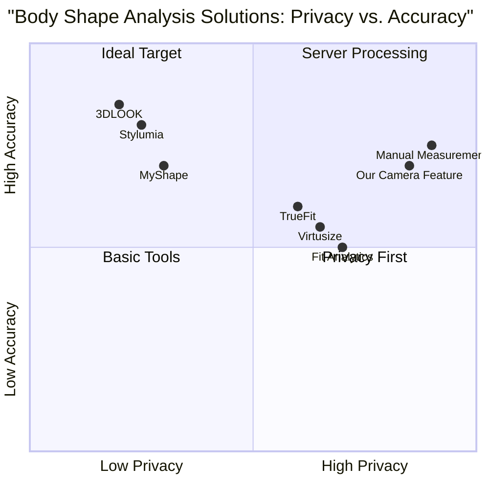

# Product Requirements Document: Camera Body Shape Analysis Feature

## 1. Language & Project Info

**Language:** English (matching user requirements)

**Programming Language:** TypeScript, React, Shadcn-ui, Tailwind CSS

**Project Name:** `bodyanalysis.colorscode.org` (existing deployment)

**Original Requirements Restatement:**
Add a browser-based camera body shape analysis feature to the existing React web app deployed at bodyanalysis.colorscode.org. The feature must:
- Operate entirely in the browser (no native app)
- Require explicit camera consent before activation
- Use client-side pose/landmark detection
- NOT store any images
- Provide consumer-grade accuracy
- Detect shoulders, waist, and hips (relative ratios only)
- Classify body shape into: Hourglass, Pear, Inverted Triangle, Rectangle, Apple
- Show retry message for poor scan quality
- Offer manual fallback (concept only, not implementation)
- NOT add results page or PDF
- NOT change existing deployment

## 2. Product Definition

### 2.1 Product Goals

**Goal 1: Accessible Body Shape Analysis**
Provide users with an accessible, privacy-focused method to determine their body shape classification using only their device's camera and browser, eliminating the need for manual measurements or specialized equipment.

**Goal 2: Privacy-First User Experience**
Implement a completely client-side analysis system that processes all camera data locally without storing, transmitting, or persisting any images or biometric data, ensuring user privacy and data protection.

**Goal 3: Seamless Integration**
Deliver a modular feature that integrates smoothly with the existing bodyanalysis.colorscode.org application without disrupting current functionality, deployment, or user workflows.

### 2.2 User Stories

**User Story 1: First-Time User**
As a new user interested in understanding my body shape for styling purposes, I want to use my smartphone camera to get an instant body shape classification, so that I can receive personalized fashion recommendations without needing measuring tape or assistance.

**User Story 2: Privacy-Conscious User**
As a privacy-conscious individual, I want to use a body shape analysis tool that processes everything locally in my browser without uploading my images to any server, so that I can feel secure about my biometric data.

**User Story 3: Mobile User**
As a mobile user with limited technical knowledge, I want a simple, guided camera experience with clear consent prompts and real-time feedback, so that I can complete the analysis quickly without confusion or technical hurdles.

**User Story 4: User with Suboptimal Conditions**
As a user in a poorly lit environment or with limited space, I want clear feedback when scan quality is insufficient, along with the option to switch to manual measurements, so that I can still complete the analysis successfully.

**User Story 5: Returning User**
As a returning user who wants to track changes over time, I want to be able to repeat the camera analysis periodically, so that I can monitor how my body shape classification evolves with lifestyle changes.

### 2.3 Competitive Analysis

**1. Stylumia (AI Fashion Platform)**
- **Pros:** Enterprise-grade AI, integrates with e-commerce, provides detailed body measurements
- **Cons:** Requires professional setup, expensive, stores user data on servers
- **Relevance:** Shows advanced computer vision capabilities but lacks privacy focus

**2. 3DLOOK (Mobile Body Scanning)**
- **Pros:** High accuracy 3D scanning, detailed measurements, SDK available
- **Cons:** Native app required, complex implementation, data processing on servers
- **Relevance:** Demonstrates mobile body scanning technology but violates our browser-only requirement

**3. TrueFit (Size Recommendation)**
- **Pros:** Extensive sizing database, integrates with major retailers
- **Cons:** Requires manual measurements or clothing size input, not camera-based
- **Relevance:** Shows market need for body shape analysis but uses different methodology

**4. MyShape (Virtual Fitting Room)**
- **Pros:** Camera-based measurement, virtual try-on features
- **Cons:** Requires account creation, stores user data, complex interface
- **Relevance:** Similar camera-based approach but with less privacy focus

**5. Fit Analytics (Size Advisor)**
- **Pros:** Simple questionnaire-based approach, no camera required
- **Cons:** Less accurate than measurements, requires user input
- **Relevance:** Alternative approach showing market demand for body shape solutions

**6. Virtusize (Visual Size Comparison)**
- **Pros:** Visual comparison tool, integrates with e-commerce
- **Cons:** Requires reference clothing items, not body measurement focused
- **Relevance:** Shows alternative approaches to body fit assessment

**7. Google's MediaPipe Pose (Technology)**
- **Pros:** State-of-the-art pose detection, free, browser-compatible
- **Cons:** Technical implementation required, iOS Safari limitations
- **Relevance:** Core technology we can leverage for our solution

### 2.4 Competitive Quadrant Chart



## 3. Technical Specifications

### 3.1 Requirements Analysis

**Core Technical Requirements:**
1. **Browser-Only Execution:** All processing must occur client-side using Web APIs
2. **Camera Access:** Secure camera access via `getUserMedia` API with proper consent flow
3. **Pose Detection:** Real-time body landmark detection using TensorFlow.js or MediaPipe
4. **Local Processing:** No image storage or transmission to external servers
5. **Cross-Browser Compatibility:** Support for Chrome, Firefox, Safari, Edge
6. **Mobile Responsive:** Optimized for smartphone camera usage
7. **Performance:** Real-time processing at 15-30 FPS on consumer devices
8. **Error Handling:** Graceful degradation for unsupported browsers or poor conditions

**Integration Requirements:**
1. **Non-Disruptive:** Must not break existing bodyanalysis.colorscode.org functionality
2. **Modular Architecture:** Feature can be enabled/disabled without affecting core app
3. **Existing Styling:** Use existing Shadcn-ui components and Tailwind CSS classes
4. **No Database Changes:** No new database tables or schema modifications
5. **Deployment Compatible:** Works with current Vercel deployment configuration

### 3.2 Requirements Pool

**P0: Must-Have (MVP)**
- [ ] Camera consent modal with explicit permission request
- [ ] TensorFlow.js MoveNet integration for pose detection
- [ ] Shoulder, waist, and hip landmark detection
- [ ] Relative ratio calculation algorithm
- [ ] Body shape classification (5 categories)
- [ ] Real-time camera feed with pose overlay
- [ ] Scan quality assessment
- [ ] Retry messaging for poor quality scans
- [ ] Manual fallback placeholder (UI only)
- [ ] Mobile-responsive camera interface
- [ ] Privacy disclaimer (no image storage)

**P1: Should-Have (Enhanced UX)**
- [ ] Multiple pose detection model support (MoveNet & BlazePose)
- [ ] Pose guidance animations/directions
- [ ] Confidence score display
- [ ] Measurement history (local storage only)
- [ ] Environmental condition feedback (lighting, distance)
- [ ] Advanced error states and recovery
- [ ] Performance optimization for lower-end devices

**P2: Nice-to-Have (Future Enhancements)**
- [ ] 3D pose estimation (BlazePose 3D)
- [ ] Multiple pose capture for improved accuracy
- [ ] Side profile analysis capability
- [ ] Body shape change tracking over time
- [ ] Export measurements (text only)
- [ ] Accessibility features (screen reader support)
- [ ] Offline capability with service worker

### 3.3 UI Design Draft

**Camera Analysis Flow:**
1. **Entry Point:** New "Camera Analysis" button on existing questionnaire page
2. **Consent Screen:** Full-screen modal with:
   - Camera permission explanation
   - Privacy guarantee (no storage/transmission)
   - "Start Camera" and "Cancel" buttons
3. **Camera Interface:**
   - Full-screen camera preview
   - Pose overlay showing detected landmarks
   - Guidance text/animations for positioning
   - "Capture" button (enabled when pose detected)
   - "Switch Camera" button (front/back toggle)
   - "Cancel" button to exit
4. **Processing State:**
   - Loading spinner
   - "Analyzing your pose..." message
5. **Results Display:**
   - Body shape classification card
   - Confidence percentage
   - Visual diagram of shape
   - "Use This Result" button (integrates with existing flow)
   - "Retry Analysis" button
   - "Enter Manual Measurements" button (placeholder)

**Error States:**
- Camera permission denied
- No camera available
- Poor lighting/visibility
- Person not detected
- Pose detection failed
- Scan quality insufficient

### 3.4 Technical Implementation Details

**Pose Detection Library Selection:**
- **Primary:** TensorFlow.js MoveNet (single-pose, lightning variant)
- **Fallback:** MediaPipe BlazePose (lite variant, tfjs runtime)
- **Rationale:** Maximum browser compatibility including iOS Safari

**Key Landmark Detection:**
- Shoulders: Landmarks 5 & 6 (left/right shoulder)
- Waist: Estimated midpoint between shoulders and hips
- Hips: Landmarks 11 & 12 (left/right hip)
- Additional: Ankles for height normalization

**Body Shape Classification Algorithm:**
```
Input: shoulder_width, waist_circumference, hip_width
Output: shape_category, confidence_score

Algorithm Steps:
1. Normalize measurements relative to height
2. Calculate ratios:
   - Shoulder-to-Hip Ratio (SHR) = shoulder_width / hip_width
   - Waist-to-Hip Ratio (WHR) = waist_circumference / hip_width
   - Shoulder-to-Waist Ratio (SWR) = shoulder_width / waist_circumference
3. Apply classification rules:
   
   IF (|shoulder_width - hip_width| ≤ threshold1) AND (waist_circumference < min(shoulder_width, hip_width) - threshold2)
   THEN Hourglass
   
   IF hip_width > shoulder_width + threshold3 AND WHR < threshold4
   THEN Pear
   
   IF shoulder_width > hip_width + threshold3 AND SWR < threshold4
   THEN Inverted Triangle
   
   IF |shoulder_width - waist_circumference| ≤ threshold5 AND |waist_circumference - hip_width| ≤ threshold5
   THEN Rectangle
   
   IF waist_circumference ≥ shoulder_width AND waist_circumference ≥ hip_width
   THEN Apple
   
   ELSE Unknown/Undefined
```

**Quality Assessment Metrics:**
1. **Landmark Confidence:** All required landmarks > 0.7 confidence
2. **Pose Frontality:** Shoulder-hip alignment within 15 degrees
3. **Frame Fill:** Person occupies 40-80% of frame height
4. **Stability:** Landmark positions stable for 1+ seconds
5. **Lighting:** No extreme shadows or overexposure

**Privacy Implementation:**
- No `File` objects created from camera stream
- Canvas used for processing, immediately cleared
- No localStorage of image data
- Only numerical measurements stored (optional)
- Camera stream released immediately after use

### 3.5 Integration Points

**Existing Codebase Integration:**
1. **New Route:** `/camera-analysis` (optional, could be modal-based)
2. **Component Location:** `src/components/camera/BodyShapeScanner.tsx`
3. **State Management:** React hooks for camera state
4. **Styling:** Existing Tailwind classes, Shadcn-ui components
5. **Error Handling:** Existing error boundary and toast system

**Data Flow to Existing System:**
```
Camera Analysis → Body Shape Classification → Existing Questionnaire
      ↓
Shape stored in React state → Used for existing recommendations
```

**Environment Variables:**
```
# Optional: Model loading optimization
NEXT_PUBLIC_TFJS_MODEL_URL=https://tfhub.dev/google/movenet/singlepose/lightning/4
NEXT_PUBLIC_MEDIAPIPE_MODEL_URL=/models/pose_detection
```

### 3.6 Open Questions

1. **Camera Orientation:** How to handle different device orientations (portrait vs landscape)?
2. **Clothing Considerations:** How does clothing affect landmark detection accuracy?
3. **Height Estimation:** Should we estimate height from pose or request user input?
4. **Model Loading:** Where to host TF.js models for optimal loading speed?
5. **Browser Support:** Minimum browser versions to support?
6. **Performance Budget:** Maximum acceptable analysis time?
7. **Accessibility:** How to make camera interface accessible to users with disabilities?
8. **Legal Compliance:** Specific privacy disclosures required by region?
9. **Error Recovery:** Should we implement automatic retry logic?
10. **Testing Strategy:** How to test camera features in CI/CD pipeline?

### 3.7 Success Metrics

**Quantitative Metrics:**
- Camera permission grant rate > 70%
- Successful scan completion rate > 60%
- Average analysis time < 10 seconds
- Classification confidence > 75%
- User satisfaction score > 4/5
- Feature adoption rate > 40% of users

**Qualitative Metrics:**
- User feedback on ease of use
- Privacy perception improvements
- Integration seamlessness
- Mobile experience quality
- Error recovery effectiveness

### 3.8 Risk Assessment

**Technical Risks:**
1. **Browser Compatibility:** iOS Safari limitations with MediaPipe
2. **Performance:** Lower-end devices may struggle with real-time detection
3. **Accuracy:** Consumer-grade accuracy may not meet all user expectations
4. **Camera Access:** Increasing browser restrictions on camera permissions

**Mitigation Strategies:**
1. Use TensorFlow.js runtime for maximum compatibility
2. Implement performance detection and quality degradation
3. Set clear accuracy expectations in UI
4. Provide clear value proposition to encourage permission grants

**Business Risks:**
1. **Privacy Concerns:** Even with local processing, users may distrust camera features
2. **Feature Adoption:** Users may prefer manual input over camera
3. **Support Burden:** New feature may increase support requests

**Mitigation Strategies:**
1. Transparent privacy messaging and guarantees
2. Seamless manual fallback option
3. Comprehensive documentation and help resources

## 4. Appendix

### 4.1 Technical References

**TensorFlow.js Pose Detection:**
- MoveNet: Ultra-fast pose detection (17 keypoints)
- BlazePose: Higher fidelity (33 keypoints, 3D capable)
- PoseNet: Legacy model (deprecated for new projects)

**Browser APIs Required:**
- `navigator.mediaDevices.getUserMedia()`
- `HTMLCanvasElement`
- `WebGL` (for GPU acceleration)
- `OffscreenCanvas` (for worker processing)

**Measurement Thresholds (Research-Based):**
- Hourglass: Waist 25%+ smaller than bust/hips
- Pear: Hips 5%+ wider than shoulders
- Inverted Triangle: Shoulders 5%+ wider than hips
- Rectangle: All measurements within 5% of each other
- Apple: Waist measurement largest

### 4.2 Implementation Timeline

**Phase 1: Foundation (Week 1-2)**
- Camera permission flow
- Basic camera interface
- TensorFlow.js integration
- Simple pose detection

**Phase 2: Core Algorithm (Week 3-4)**
- Landmark detection refinement
- Measurement calculation
- Shape classification algorithm
- Quality assessment

**Phase 3: Polish (Week 5-6)**
- UI/UX refinement
- Error states and recovery
- Performance optimization
- Cross-browser testing

**Phase 4: Integration (Week 7-8)**
- Integration with existing app
- User testing
- Bug fixes
- Documentation

### 4.3 Testing Strategy

**Unit Tests:**
- Measurement calculation functions
- Shape classification algorithm
- Utility functions

**Integration Tests:**
- Camera permission flow
- Pose detection integration
- Component state management

**Manual Tests:**
- Cross-browser compatibility
- Mobile device testing
- Camera hardware variations
- Lighting condition variations

**User Testing:**
- Usability testing with target users
- A/B testing of consent flows
- Accuracy validation against manual measurements

### 4.4 Deployment Checklist

- [ ] Verify no breaking changes to existing functionality
- [ ] Test on target browsers (Chrome, Safari, Firefox, Edge)
- [ ] Test on mobile devices (iOS, Android)
- [ ] Verify camera permissions work correctly
- [ ] Confirm no images are stored or transmitted
- [ ] Performance testing on lower-end devices
- [ ] Accessibility testing
- [ ] Privacy compliance review
- [ ] Update documentation
- [ ] Prepare rollback plan

---

*Document Version: 1.0*  
*Last Updated: 2026-01-01*  
*Author: Emma, Product Manager*  
*Status: Ready for Development*