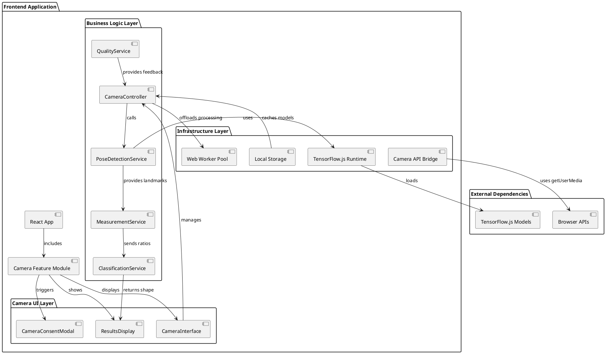
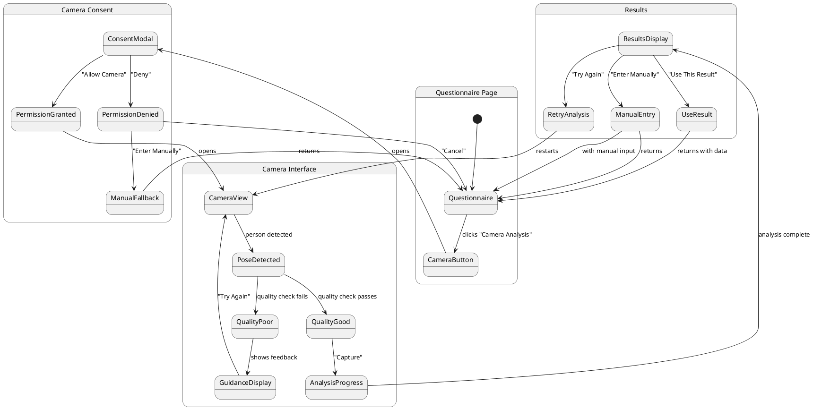
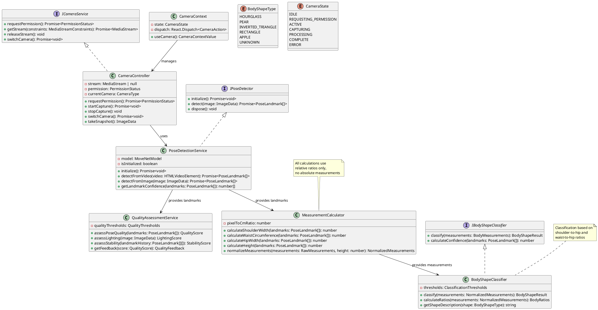
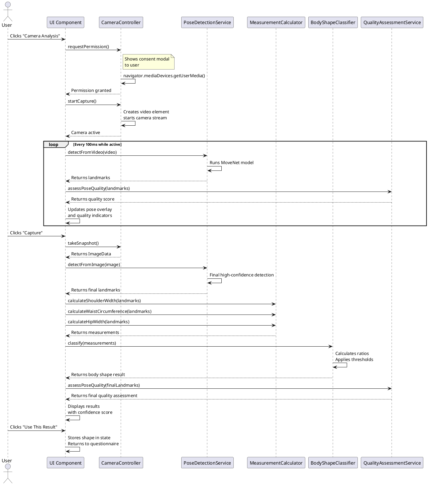

# System Design: Camera Body Shape Analysis Feature

## 1. Implementation Approach

We will implement a browser-based camera body shape analysis feature with the following architecture:

### 1.1 Core Components
1. **Camera Permission Manager** - Handles explicit user consent and camera access
2. **Pose Detection Engine** - Client-side pose detection using TensorFlow.js MoveNet
3. **Measurement Calculator** - Processes landmarks to extract body measurements
4. **Shape Classifier** - Classifies body shape based on calculated ratios
5. **Quality Assessor** - Evaluates scan quality and provides feedback
6. **Camera UI Controller** - Manages camera stream and user interface state

### 1.2 Technology Stack
- **Frontend Framework**: React 18 with TypeScript
- **Pose Detection**: TensorFlow.js MoveNet (Lightning variant) for maximum browser compatibility
- **Camera API**: `navigator.mediaDevices.getUserMedia()`
- **UI Components**: Existing Shadcn-ui components + Tailwind CSS
- **State Management**: React Context + Custom Hooks
- **Performance**: Web Workers for pose detection processing

### 1.3 Key Design Decisions
1. **Privacy-First Architecture**: All processing occurs client-side with no image storage
2. **Progressive Enhancement**: Graceful degradation for unsupported browsers
3. **Modular Design**: Feature can be toggled on/off without affecting core application
4. **Performance Optimization**: Lazy loading of TensorFlow.js models
5. **Cross-Browser Support**: Focus on Chrome, Safari, Firefox, Edge with iOS compatibility

## 2. Main User-UI Interaction Patterns

### 2.1 Camera Analysis Flow
```
User → Questionnaire Page → Camera Analysis Button → Consent Modal → Camera Interface → 
Real-time Pose Detection → Quality Check → Analysis → Results Display → Integration with Existing Flow
```

### 2.2 Interaction Scenarios
1. **Successful Analysis**: User grants permission, stands correctly, gets immediate classification
2. **Permission Denied**: Clear explanation and manual fallback option
3. **Poor Quality Scan**: Real-time feedback with specific guidance (lighting, distance, pose)
4. **Technical Limitations**: Graceful fallback for unsupported browsers/devices
5. **Retry Flow**: Simple retry mechanism with improved guidance

## 3. System Architecture



## 4. UI Navigation Flow



## 5. Class Diagram



## 6. Sequence Diagram



## 7. Data Structures & Interfaces

### 7.1 Type Definitions
```typescript
// Core types for pose detection
interface PoseLandmark {
  x: number;          // Normalized x coordinate (0-1)
  y: number;          // Normalized y coordinate (0-1)
  z?: number;         // Normalized z coordinate (0-1, optional)
  score: number;      // Confidence score (0-1)
  name: string;       // Landmark name (e.g., "left_shoulder")
}

interface BodyMeasurements {
  shoulderWidth: number;     // Relative units (pixels normalized by height)
  waistCircumference: number; // Relative units
  hipWidth: number;          // Relative units
  height: number;            // Relative units (pixels)
}

interface BodyRatios {
  shoulderToHip: number;     // shoulderWidth / hipWidth
  waistToHip: number;        // waistCircumference / hipWidth
  shoulderToWaist: number;   // shoulderWidth / waistCircumference
}

interface BodyShapeResult {
  shape: BodyShapeType;
  confidence: number;        // 0-1 confidence score
  ratios: BodyRatios;
  measurements: BodyMeasurements;
  quality: QualityScore;
}

interface QualityScore {
  overall: number;           // 0-1 overall quality
  landmarks: number;         // Landmark confidence score
  stability: number;         // Pose stability score
  lighting: number;          // Lighting condition score
  framing: number;           // Person framing in frame
}

interface QualityFeedback {
  message: string;
  suggestions: string[];
  canProceed: boolean;
}

// Camera state management
interface CameraState {
  status: CameraStatus;
  permission: PermissionStatus;
  stream: MediaStream | null;
  currentCamera: 'front' | 'back';
  error: string | null;
  landmarks: PoseLandmark[] | null;
  quality: QualityScore | null;
}

// Context and hooks
interface CameraContextValue {
  state: CameraState;
  requestPermission: () => Promise<void>;
  startCamera: () => Promise<void>;
  stopCamera: () => void;
  capture: () => Promise<BodyShapeResult>;
  switchCamera: () => Promise<void>;
  reset: () => void;
}
```

### 7.2 Configuration Types
```typescript
interface PoseDetectionConfig {
  modelType: 'movenet' | 'blazepose';
  modelUrl: string;
  maxPoses: number;
  scoreThreshold: number;
  nmsRadius: number;
}

interface ClassificationThresholds {
  hourglass: {
    shoulderHipDiff: number;      // Maximum difference for hourglass
    waistReduction: number;       // Minimum waist reduction
  };
  pear: {
    hipShoulderDiff: number;      // Minimum hip > shoulder difference
    waistHipRatio: number;        // Maximum waist-to-hip ratio
  };
  invertedTriangle: {
    shoulderHipDiff: number;      // Minimum shoulder > hip difference
    shoulderWaistRatio: number;   // Maximum shoulder-to-waist ratio
  };
  rectangle: {
    measurementVariance: number;  // Maximum variance between measurements
  };
  apple: {
    waistDominance: number;       // Minimum waist dominance over others
  };
}

interface QualityThresholds {
  minLandmarkConfidence: number;  // Minimum confidence for key landmarks
  minPoseStability: number;       // Minimum stability score
  minLightingScore: number;       // Minimum lighting quality
  frameFillMin: number;           // Minimum person fill in frame (0-1)
  frameFillMax: number;           // Maximum person fill in frame (0-1)
}
```

## 8. Algorithm Details

### 8.1 Pose Landmark Detection
```typescript
// MoveNet landmark indices (17 keypoints)
const LANDMARK_INDICES = {
  NOSE: 0,
  LEFT_EYE: 1,
  RIGHT_EYE: 2,
  LEFT_EAR: 3,
  RIGHT_EAR: 4,
  LEFT_SHOULDER: 5,
  RIGHT_SHOULDER: 6,
  LEFT_ELBOW: 7,
  RIGHT_ELBOW: 8,
  LEFT_WRIST: 9,
  RIGHT_WRIST: 10,
  LEFT_HIP: 11,
  RIGHT_HIP: 12,
  LEFT_KNEE: 13,
  RIGHT_KNEE: 14,
  LEFT_ANKLE: 15,
  RIGHT_ANKLE: 16
};

// Key landmarks for body shape analysis
const KEY_LANDMARKS = [
  LANDMARK_INDICES.LEFT_SHOULDER,
  LANDMARK_INDICES.RIGHT_SHOULDER,
  LANDMARK_INDICES.LEFT_HIP,
  LANDMARK_INDICES.RIGHT_HIP
];
```

### 8.2 Measurement Calculation Algorithm
```typescript
function calculateBodyMeasurements(landmarks: PoseLandmark[]): BodyMeasurements {
  // 1. Extract key landmarks
  const leftShoulder = landmarks[LANDMARK_INDICES.LEFT_SHOULDER];
  const rightShoulder = landmarks[LANDMARK_INDICES.RIGHT_SHOULDER];
  const leftHip = landmarks[LANDMARK_INDICES.LEFT_HIP];
  const rightHip = landmarks[LANDMARK_INDICES.RIGHT_HIP];
  const leftAnkle = landmarks[LANDMARK_INDICES.LEFT_ANKLE];
  const rightAnkle = landmarks[LANDMARK_INDICES.RIGHT_ANKLE];
  
  // 2. Calculate shoulder width (Euclidean distance)
  const shoulderWidth = Math.sqrt(
    Math.pow(rightShoulder.x - leftShoulder.x, 2) +
    Math.pow(rightShoulder.y - leftShoulder.y, 2)
  );
  
  // 3. Calculate hip width
  const hipWidth = Math.sqrt(
    Math.pow(rightHip.x - leftHip.x, 2) +
    Math.pow(rightHip.y - leftHip.y, 2)
  );
  
  // 4. Estimate waist circumference (midpoint between shoulders and hips)
  const shoulderMidY = (leftShoulder.y + rightShoulder.y) / 2;
  const hipMidY = (leftHip.y + rightHip.y) / 2;
  const waistY = shoulderMidY + (hipMidY - shoulderMidY) * 0.3;
  
  // Estimate waist width as interpolation between shoulders and hips
  const waistWidth = shoulderWidth * 0.7 + hipWidth * 0.3;
  const waistCircumference = waistWidth * Math.PI; // Approximate circumference
  
  // 5. Calculate height (ankle to shoulder)
  const shoulderAvgY = (leftShoulder.y + rightShoulder.y) / 2;
  const ankleAvgY = (leftAnkle.y + rightAnkle.y) / 2;
  const height = Math.abs(shoulderAvgY - ankleAvgY);
  
  return {
    shoulderWidth,
    waistCircumference,
    hipWidth,
    height
  };
}
```

### 8.3 Body Shape Classification Algorithm
```typescript
function classifyBodyShape(measurements: BodyMeasurements, thresholds: ClassificationThresholds): BodyShapeResult {
  const ratios = calculateRatios(measurements);
  
  // Check for Hourglass
  const shoulderHipDiff = Math.abs(measurements.shoulderWidth - measurements.hipWidth);
  const waistReduction = Math.min(measurements.shoulderWidth, measurements.hipWidth) - measurements.waistCircumference;
  
  if (shoulderHipDiff <= thresholds.hourglass.shoulderHipDiff &&
      waistReduction >= thresholds.hourglass.waistReduction) {
    return {
      shape: 'HOURGLASS',
      confidence: calculateConfidence(ratios, 'HOURGLASS'),
      ratios,
      measurements
    };
  }
  
  // Check for Pear
  if (measurements.hipWidth > measurements.shoulderWidth + thresholds.pear.hipShoulderDiff &&
      ratios.waistToHip < thresholds.pear.waistHipRatio) {
    return {
      shape: 'PEAR',
      confidence: calculateConfidence(ratios, 'PEAR'),
      ratios,
      measurements
    };
  }
  
  // Check for Inverted Triangle
  if (measurements.shoulderWidth > measurements.hipWidth + thresholds.invertedTriangle.shoulderHipDiff &&
      ratios.shoulderToWaist < thresholds.invertedTriangle.shoulderWaistRatio) {
    return {
      shape: 'INVERTED_TRIANGLE',
      confidence: calculateConfidence(ratios, 'INVERTED_TRIANGLE'),
      ratios,
      measurements
    };
  }
  
  // Check for Rectangle
  const measurementsArray = [measurements.shoulderWidth, measurements.waistCircumference, measurements.hipWidth];
  const variance = calculateVariance(measurementsArray);
  
  if (variance <= thresholds.rectangle.measurementVariance) {
    return {
      shape: 'RECTANGLE',
      confidence: calculateConfidence(ratios, 'RECTANGLE'),
      ratios,
      measurements
    };
  }
  
  // Check for Apple
  if (measurements.waistCircumference >= measurements.shoulderWidth &&
      measurements.waistCircumference >= measurements.hipWidth + thresholds.apple.waistDominance) {
    return {
      shape: 'APPLE',
      confidence: calculateConfidence(ratios, 'APPLE'),
      ratios,
      measurements
    };
  }
  
  // Default to unknown
  return {
    shape: 'UNKNOWN',
    confidence: 0,
    ratios,
    measurements
  };
}
```

### 8.4 Quality Assessment Algorithm
```typescript
function assessScanQuality(landmarks: PoseLandmark[], imageData?: ImageData): QualityScore {
  // 1. Landmark confidence assessment
  const keyLandmarkConfidences = KEY_LANDMARKS.map(idx => landmarks[idx]?.score || 0);
  const landmarkScore = average(keyLandmarkConfidences);
  
  // 2. Pose stability assessment (if history available)
  const stabilityScore = assessStability(landmarkHistory);
  
  // 3. Lighting assessment
  const lightingScore = imageData ? assessLighting(imageData) : 0.7;
  
  // 4. Framing assessment
  const boundingBox = calculateBoundingBox(landmarks);
  const frameFill = boundingBox.height; // Normalized height in frame
  const framingScore = frameFill >= 0.4 && frameFill <= 0.8 ? 1.0 : 0.5;
  
  // 5. Pose frontality assessment
  const shoulderAngle = calculateShoulderAngle(landmarks);
  const hipAngle = calculateHipAngle(landmarks);
  const frontalityScore = Math.abs(shoulderAngle - hipAngle) < 15 ? 1.0 : 0.6;
  
  // Calculate overall score
  const overall = (landmarkScore * 0.4) + (stabilityScore * 0.2) + 
                  (lightingScore * 0.2) + (framingScore * 0.1) + 
                  (frontalityScore * 0.1);
  
  return {
    overall,
    landmarks: landmarkScore,
    stability: stabilityScore,
    lighting: lightingScore,
    framing: framingScore
  };
}
```

## 9. Integration Points with Existing Application

### 9.1 File Structure
```
src/
├── components/
│   ├── camera/
│   │   ├── CameraConsentModal.tsx      # Camera permission modal
│   │   ├── CameraInterface.tsx         # Main camera UI component
│   │   ├── PoseOverlay.tsx             # Pose visualization overlay
│   │   ├── ResultsDisplay.tsx          # Analysis results display
│   │   └── QualityIndicator.tsx        # Real-time quality feedback
│   └── ui/                             # Existing Shadcn-ui components
│
├── hooks/
│   ├── useCamera.ts                    # Camera management hook
│   └── usePoseDetection.ts             # Pose detection hook
│
├── services/
│   ├── poseDetection/
│   │   ├── PoseDetectionService.ts     # TensorFlow.js integration
│   │   ├── MeasurementCalculator.ts    # Body measurement calculations
│   │   ├── BodyShapeClassifier.ts      # Shape classification
│   │   └── QualityAssessmentService.ts # Scan quality assessment
│   └── camera/
│       └── CameraService.ts            # Camera API wrapper
│
├── contexts/
│   └── CameraContext.tsx               # Camera state context
│
├── pages/
│   ├── Questionnaire.tsx               # Existing questionnaire (modified)
│   └── CameraAnalysis.tsx              # Optional dedicated page
│
└── types/
    └── camera.ts                       # Type definitions
```

### 9.2 Integration with Questionnaire Page
```typescript
// In src/pages/Questionnaire.tsx
import { CameraAnalysisButton } from '@/components/camera/CameraAnalysisButton';
import { useCameraAnalysis } from '@/hooks/useCameraAnalysis';

function Questionnaire() {
  const { bodyShape, setBodyShape } = useQuestionnaireState();
  const { startCameraAnalysis } = useCameraAnalysis({
    onComplete: (result) => {
      setBodyShape(result.shape);
      // Auto-fill relevant questionnaire fields
    }
  });

  return (
    <div>
      {/* Existing questionnaire fields */}
      
      <div className="mt-8">
        <CameraAnalysisButton 
          onClick={startCameraAnalysis}
          currentShape={bodyShape}
        />
      </div>
      
      {/* Rest of questionnaire */}
    </div>
  );
}
```

### 9.3 State Integration
```typescript
// Extend existing questionnaire state
interface QuestionnaireState {
  // Existing fields...
  bodyShape?: BodyShapeType;
  bodyMeasurements?: BodyMeasurements;
  cameraAnalysisUsed: boolean;
}

// Add to submission data
interface SubmissionData {
  // Existing fields...
  body_shape?: string;
  body_measurements?: Record<string, number>;
  analysis_method: 'manual' | 'camera';
}
```

## 10. Error Handling & Edge Cases

### 10.1 Error Scenarios
1. **Camera Permission Denied**
   - Show clear explanation
   - Provide manual entry option
   - Suggest browser settings instructions

2. **No Camera Available**
   - Detect via `navigator.mediaDevices.enumerateDevices()`
   - Show appropriate message
   - Auto-fallback to manual entry

3. **Poor Detection Quality**
   - Real-time feedback with specific suggestions
   - Automatic retry with guidance
   - Option to proceed with low confidence

4. **Performance Issues**
   - Detect FPS and adjust processing rate
   - Offer simplified mode for lower-end devices
   - Graceful degradation of features

5. **Browser Compatibility**
   - Feature detection for required APIs
   - Polyfills for older browsers
   - Clear unsupported browser message

### 10.2 Recovery Strategies
```typescript
const ERROR_RECOVERY_STRATEGIES = {
  PERMISSION_DENIED: {
    action: 'show_manual_fallback',
    message: 'Camera access is required for this feature.',
    retryable: false
  },
  NO_CAMERA: {
    action: 'show_manual_fallback',
    message: 'No camera detected on your device.',
    retryable: false
  },
  POOR_QUALITY: {
    action: 'provide_guidance',
    message: 'Please adjust your position for better detection.',
    retryable: true,
    maxRetries: 3
  },
  DETECTION_FAILED: {
    action: 'retry_with_simplified_model',
    message: 'Having trouble detecting pose. Trying simplified model...',
    retryable: true,
    maxRetries: 2
  }
};
```

## 11. Performance Considerations

### 11.1 Optimization Strategies
1. **Lazy Loading**: Load TensorFlow.js only when camera feature is accessed
2. **Model Optimization**: Use quantized models for faster inference
3. **Frame Skipping**: Process every 2-3 frames instead of every frame
4. **Web Workers**: Offload pose detection to background threads
5. **Memory Management**: Proper disposal of tensors and streams

### 11.2 Performance Budget
- Initial load time: < 3 seconds (including model download)
- Detection latency: < 100ms per frame
- Memory usage: < 100MB additional
- Analysis time: < 5 seconds total

## 12. Testing Strategy

### 12.1 Unit Tests
- Measurement calculation accuracy
- Shape classification logic
- Quality assessment algorithms
- Camera service methods

### 12.2 Integration Tests
- Camera permission flow
- Pose detection integration
- Component state management
- Error handling scenarios

### 12.3 Manual Tests
- Cross-browser compatibility
- Mobile device testing
- Camera hardware variations
- Lighting condition variations

## 13. Deployment Considerations

### 13.1 Environment Variables
```env
# Optional: Custom model URLs
NEXT_PUBLIC_TFJS_MODEL_URL=https://tfhub.dev/google/movenet/singlepose/lightning/4
NEXT_PUBLIC_ENABLE_CAMERA_FEATURE=true
NEXT_PUBLIC_CAMERA_QUALITY_THRESHOLD=0.7
```

### 13.2 Build Configuration
- Tree-shaking to exclude TensorFlow.js from main bundle
- Code splitting for camera feature
- Asset optimization for model files
- Service worker for offline model caching

### 13.3 Monitoring
- Feature usage analytics
- Error rate tracking
- Performance metrics collection
- User satisfaction surveys

## 14. Anything UNCLEAR

### 14.1 Clarifications Needed
1. **Height Normalization**: Should we request user height input or estimate from pose?
2. **Clothing Impact**: How to handle different clothing types affecting landmark detection?
3. **Model Hosting**: Where to host TensorFlow.js models for optimal global performance?
4. **Accuracy Validation**: Method for validating classification accuracy against ground truth?
5. **Accessibility**: Specific requirements for screen reader users and motor impairments?

### 14.2 Assumptions Made
1. **Privacy Compliance**: Client-side processing satisfies privacy requirements
2. **Browser Support**: Target modern browsers (last 2 versions of major browsers)
3. **Device Capabilities**: Users have devices with working cameras and sufficient processing power
4. **User Cooperation**: Users will follow positioning guidelines for best results
5. **Integration Scope**: Feature integrates at questionnaire level, not as standalone page

### 14.3 Technical Uncertainties
1. **iOS Safari Performance**: TensorFlow.js performance on iOS Safari may vary
2. **Model Accuracy**: Consumer-grade accuracy may need calibration for diverse body types
3. **Lighting Conditions**: Algorithm robustness in varying lighting conditions
4. **Camera Quality**: Impact of different camera resolutions and qualities
5. **Network Conditions**: Model download time on slow connections

---

*Document Version: 1.0*  
*Last Updated: 2026-01-01*  
*Author: Bob, Software Architect*  
*Status: Ready for Implementation*